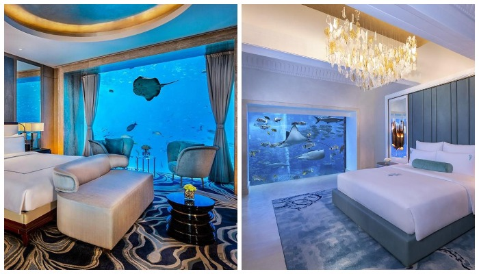

# Unforgettable view outside the window: 5 underwater hotel rooms

Today's travelers are not much of a surprise, but underwater hotel rooms are still a curiosity that not all hotel complexes can offer. Recently, there are unique facilities where you can literally sleep together with the fish. For those looking for the right resort hotel, we offer a look at 5 amazing rooms with unsurpassed underwater views and special accommodation conditions.

## Atlantis the Palm 5 Underwater Suites in Dubai, UAE

Atlantis the Palm 5 Underwater Suites in Dubai offer a fantastic underwater experience in a totally relaxing underwater world surrounded by the realities of the ocean. Named Poseidon and Neptune, the spacious suites within the waters of the Ambassador Lagoon offer an unforgettable experience in luxurious surroundings.

Huge floor-to-ceiling windows allow you to observe marine life, with even sharks and giant stingrays gliding alongside the bed or marble bathtub. And in the living room you can see the waves peacefully splashing right by the window and the lights of the coastal area of the bay, because it is above the surface of the water. 

## 11 underwater suites Resorts World Sentosa (Singapore)

Nestled in the heart of the world's largest aquarium are 11 of Resorts World Sentosa's exclusive underwater suites, designed as luxury two-story townhomes. The creators of the unique hotel suites have managed to provide an unforgettable vacation both on land and at sea. And that means guests can enjoy relaxation and sea air in the cozy living room or on the outdoor patio with a Jacuzzi. They are located on the upper level, but for a special experience it is better to go down to the bedroom.

## Utter Inn in Västeras, Sweden

Underwater adventurers who cannot afford a stay in a luxurious hotel room can safely go to the Swedish town of Vesteras. Hotel Utter Inn has a colorful house on the water, created in the traditional style, which has an underwater tiny cabin. This is where the bedroom is set up. There are no frills in the room, and the dive will be only three meters deep, but the impressions of the visitors remain more than pleasant, and the cost is quite affordable.

- Synopsis: A weekend spent in the middle of Lake Mälaren will cost $500 for two days.

## Marine Hotel Reefsuites in Queensland, Australia

On the Great Barrier Reef (Australia), 60 km from the coast of Airlie Beach, Queensland has a sea hotel Reefsuites, built directly on the pontoons. 

